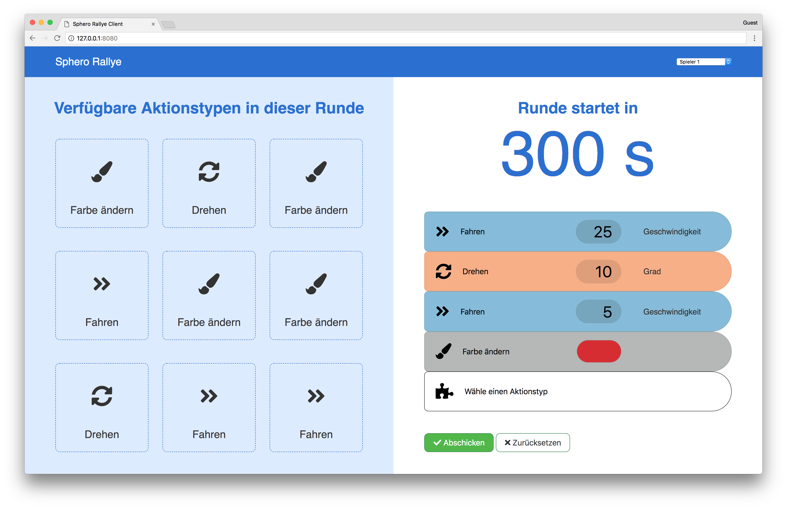

# sphero-rallye-client
Javascript client to play the rallye with one Sphero. The corresponding game server can be found [here](https://github.com/iteratec/sphero-rallye-server).



## Usage

The communication between game server and client works via the MQTT protocol.
The MQTT server needs to listen on TCP and websockets. Therefore a very simple MQTT configuration is provided: `mosquitto.conf`.
Start the MQT server:
```bash
mosquitto -c mosquitto.conf
``` 

In `index.js` the host and port of the MQTT server are configured.

Start the node.js web server with the following command:
```bash
npm start
```